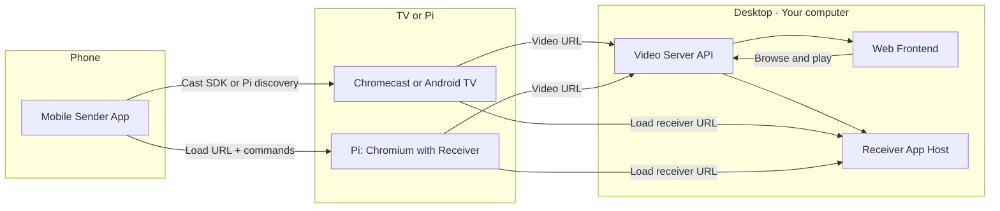

# Dancecast — Implementation Plan

## Goal

Deliver a system where:

- Videos are hosted on a web server on your desktop computer.
- A **Flutter** mobile app casts those videos to a TV (Chromecast/Android TV) or to a Raspberry Pi 5, with the phone acting as a remote (play/pause, seek, speed, loop).
- The same server exposes a web frontend for testing and fallback playback.
- A custom Cast receiver implements playback and responds to remote commands.

This is a **learning plan**: the project should include extensive user documentation (how to use the app) and in-code comments that explain the various components and how they work.

Roku is out of scope for the first phase; the plan targets Chromecast/Android TV and Raspberry Pi.

---

## Architecture Overview

- **Desktop** runs the video server (Python), serves the receiver app (HTML/JS), and optionally the web frontend.
- **Mobile app** discovers Cast devices (or Pi), sends media URL and commands to the receiver.
- **Receiver** (same web app) runs on the Cast device or in Chromium on the Pi; it loads video by URL from the desktop server and handles play/pause/seek/speed/loop.
- **Web frontend** talks to the same server for browse/play (testing and fallback).

---

## Component 1: Video Server (Python, on desktop)

**Role:** Serve video files, optional library API, host the Cast receiver app and (optionally) the web frontend. All on your machine so videos stay on your computer.

**Recommended stack:** **FastAPI** (async, simple static file and range-request handling, OpenAPI). Alternative: Flask + Flask-CORS.

**Responsibilities:**

- **Video file serving:** Configure a media directory; serve files with **range request** support (required for seeking). FastAPI can use `StreamingResponse` with range handling, or mount a static route with a range-aware helper.
- **Optional library API:** Endpoints for list videos, metadata, tags, playlists (e.g. JSON from a SQLite DB or JSON files). Not required for MVP if you only need "pick a URL and cast."
- **Host receiver app:** Serve the static files of the Cast receiver (HTML/JS/CSS) at e.g. `/receiver` or a dedicated origin. Receiver must be loaded over **HTTPS** for Cast (Google requirement). Options: (a) Self-signed certificate on the desktop server and Cast device configured to trust it, or (b) Local HTTPS via something like Caddy with a local domain, or (c) Development: use Google's default receiver first and add custom receiver when HTTPS is ready.
- **Host web frontend (testing/fallback):** Serve a simple frontend at e.g. `/` that lists videos (from the same media dir or API), plays them in the browser with basic controls (play/pause, seek, speed, loop). Same backend can serve both API and static assets.

**Deliverables:** One Python project (e.g. `server/` or `video-server/`), `requirements.txt`, env/config for media path and HTTPS. Run on desktop; mobile and Cast/Pi use the desktop's LAN IP (and hostname if you set up local DNS).

---

## Component 2: Custom Cast Receiver (JavaScript, hosted by desktop)

**Role:** Web app that runs in the Cast device's browser (or in Chromium on the Pi). It receives "load this video URL" and "play/pause/seek/set speed/loop A–B" from the sender and plays the video with A/V in sync.

**Why not Python:** The Cast receiver runs inside the Cast device's (or Pi's) browser; Google's Cast Receiver SDK is JavaScript. So the receiver is **HTML/JS** (or TypeScript compiled to JS).

**Responsibilities:**

- Use **Cast Receiver SDK** (v3): register the app, handle incoming sessions, receive custom messages from the sender (e.g. media URL, loop start/end, playback rate).
- **Playback:** Use the **default Cast media element** or **HTML5 `<video>`** with a well-muxed source (e.g. MP4). Implement: play, pause, seek, `playbackRate`, and **A–B loop** (on `timeupdate`, if `currentTime >= loopEnd`, set `currentTime = loopStart`). Use a single `<video>` and one URL so A/V stay in sync.
- **Protocol:** Define a small JSON message set: e.g. `LOAD` (url, loopStart, loopEnd, initialRate), `PLAY`, `PAUSE`, `SEEK`, `SET_RATE`, `SET_LOOP`. Sender sends these over the Cast custom channel; receiver executes and can send back state (currentTime, playing, etc.) for the remote UI.
- **Discovery:** Cast devices discover your receiver by **receiver application ID** (you get one when you register the app in Google Cast Developer Console). For **Raspberry Pi**, the same receiver URL is loaded in **Chromium (kiosk mode)**; Pi does not appear in the Cast device list unless you add a separate "Pi as Cast device" layer (see Component 4). For MVP, Pi can simply open the receiver URL and the phone can "connect" to the Pi via a second channel (e.g. WebSocket to the desktop that the Pi's page also connects to, or a small bridge on the Pi).

**Deliverables:** A single receiver app (e.g. `receiver/`): `index.html`, JS bundle (e.g. `receiver.js`), built so the desktop server can serve it over HTTPS. Document the receiver application ID and how to point Cast devices at your desktop's receiver URL.

---

## Component 3: Mobile Sender App (Flutter, remote UI when playing)

**Role:** Discover Cast devices (and optionally Pi), show a way to pick a video (from the desktop server's list or URL), start casting, then show a **remote-control UI** (play/pause, rewind, speed, seek bar, loop in/out) that sends commands to the receiver.

**Stack:** **Flutter** for a single codebase on Android and iOS, using a Cast plugin (e.g. `flutter_cast_video` or community Cast packages) for discovery and custom message channel to the receiver.

**Responsibilities:**

- **Discovery:** For Cast: use Cast SDK via the Flutter plugin to discover Cast devices and start a session with your custom receiver app ID. For Pi: either (1) manual "Enter Pi URL" or (2) a small discovery (mDNS or server-registered Pi list) that then opens the receiver URL on the Pi and establishes a command channel (e.g. via your desktop server as a WebSocket hub).
- **Video selection:** Call desktop server API (or static list) to get video list; user picks one. Resolve to a **full URL** the receiver can load (e.g. `http://<desktop-ip>:port/videos/foo.mp4`). For Cast, the receiver must be able to reach this URL (LAN); ensure the receiver runs in a context that can access your LAN (it does when the receiver is loaded from the desktop and the media URL is also the desktop).
- **Remote UI:** When a session is active, show: play/pause, seek bar (sync with receiver state if receiver sends updates), speed selector (e.g. 0.5x, 0.75x, 1x, 1.25x), rewind/forward buttons, and **loop A–B** (set in/out; send SET_LOOP to receiver). Send commands over the Cast custom channel (or over the Pi bridge).

**Deliverables:** One Flutter project (e.g. `mobile_app/` or `sender_flutter/`) that works against your desktop server's API and receiver URL. Include **inline comments and short doc comments** explaining Cast session lifecycle, custom message protocol, and how the remote UI state is kept in sync with the receiver.

---

## Component 4: Raspberry Pi 5 as Receiver Display

**Role:** Use a Pi 5 as the "TV" that shows the same receiver UI and plays video, so you don't need a Chromecast for that screen.

**Approach:**

- **Display:** Run **Chromium in kiosk mode** (fullscreen, no browser chrome) and load the **same receiver app URL** as the Cast receiver (e.g. `https://<desktop>/receiver` or `http` if you use a "Pi-only" build that doesn't require Cast protocol). Pi must be on the same LAN as the desktop and have a stable hostname or IP.
- **Control from phone:** The Pi is not a Cast device by default. Two options:
  - **Option A (simplest for MVP):** Receiver page on the Pi includes a "pairing" or "session" step: user opens a screen in the Flutter app (or a page on the desktop server) that says "Enter this code on your TV" or "Scan QR to connect." Desktop server holds a WebSocket session: Pi's receiver page connects to the server with "I am Pi display," Flutter sender connects with "I am sender for session X." Server relays commands from sender to Pi. The **same Flutter app** can drive both Cast and "Pi mode" by switching the transport (Cast channel vs WebSocket to server).
  - **Option B:** Run a Cast-receiver emulator on the Pi (e.g. existing open-source projects that make the Pi appear in the Cast list). More integrated but more moving parts; can be a later phase.

**Deliverables:** A short doc or script (e.g. `pi/README.md` + optional `pi/kiosk.sh` or systemd unit) for: install Chromium, autostart in kiosk mode with the receiver URL, and (if Option A) how to pair the Flutter app to the Pi via the desktop server. Receiver app already supports "receive commands via WebSocket" in addition to Cast channel for this to work.

---

## Component 5: Web Frontend (testing and fallback)

**Role:** So you can use the app without the phone when needed: browse videos hosted on the desktop and play them in the browser with the same controls (speed, loop) as the receiver.

**Implementation:** Served by the same Python server. A simple single-page app (vanilla JS or a small framework): list videos (from server API or directory listing), click to play in an HTML5 `<video>` with custom controls (play/pause, seek, speed, loop in/out). No Cast involved; just the server and this page. Reuse the same **control logic** (speed, loop) as in the receiver so behavior is consistent.

**Deliverables:** Static assets (or a small template) under e.g. `server/static/` or a separate `web-frontend/` folder that the server mounts at `/`. Document in the main plan how to open it (e.g. `https://<desktop>/`).

---

## Technology Summary

| Component     | Technology choice                  | Reason                                                                                               |
| ------------- | ---------------------------------- | ---------------------------------------------------------------------------------------------------- |
| Video server  | Python (FastAPI)                   | Your preference; good for serving files, API, and static receiver/frontend; runs on desktop.         |
| Cast receiver | JavaScript (Cast SDK v3)           | Required by Cast; runs in browser on Cast device or Pi.                                              |
| Sender        | **Flutter**                        | Single codebase for Android and iOS; Cast plugins available; good for learning and future store app. |
| Pi display    | Chromium kiosk + same receiver URL | Reuses receiver; control via WebSocket through desktop (MVP) or Cast emulator later.                |
| Web frontend  | JS (simple SPA or vanilla)         | Same server; testing and fallback playback.                                                          |

---

## Implementation Order

1. **Video server (Python):** Range-serving of videos, configurable media path, CORS. Optional: list endpoint for videos. No HTTPS yet if you start with web-only.
2. **Web frontend:** List and play videos with speed and loop; validates server and control logic.
3. **Cast receiver (JS):** Minimal receiver that loads one URL, play/pause/seek/speed/loop; host it from the Python server. Get a receiver application ID (Google Cast Developer Console). Test by loading the receiver URL in a desktop browser and driving it with a test page that uses the Cast Web Sender API.
4. **HTTPS for receiver:** Add HTTPS to the Python server (e.g. self-signed or Caddy) so Cast devices can load the custom receiver.
5. **Mobile sender (Flutter):** Discovery, load video URL on receiver, then remote UI and custom messages. Test with a real Cast device.
6. **Pi kiosk + bridge:** Chromium kiosk on Pi loading receiver; optional WebSocket bridge on the server so the Flutter app can "cast" to the Pi; document pairing flow.
7. **Polish:** Library API (tags, playlists), time tracking, and any Roku work as a later phase.

---

## Documentation and learning (required for this plan)

This is a **learning plan**. Every component must be documented for both **end users** and **developers** so the project doubles as a reference for how casting, receivers, and the video server work.

**User documentation (extensive):**

- **README or user guide** at repo root (e.g. `README.md` or `docs/USER-GUIDE.md`): How to set up the desktop server (install, config, where to put videos, how to run it). How to open the web frontend for testing. How to use the Flutter app: connecting to the server, discovering Cast devices or the Pi, picking a video, casting, and using the remote (play/pause, seek, speed, loop A–B). How to set up the Pi (Chromium kiosk, pairing with the app if applicable). Troubleshooting (server not reachable, Cast not found, A/V sync, etc.).
- **Per-component docs** where helpful: e.g. `server/README.md` (API overview, env vars, range-serving), `receiver/README.md` (receiver app ID, message protocol), `pi/README.md` (kiosk setup, pairing). Link these from the main README.

**In-code documentation and comments:**

- **Video server (Python):** Docstrings for all public endpoints and main helpers (what they return, range behavior, CORS). Short comments explaining: why range requests matter for seeking; how the receiver and web frontend are mounted; where media path and HTTPS config are used.
- **Cast receiver (JavaScript):** Top-of-file or README note on the Cast Receiver SDK lifecycle (load, session, custom channel). Comments at each message type (LOAD, PLAY, PAUSE, SEEK, SET_RATE, SET_LOOP) describing what the sender sends and what the receiver does. Comment on the A–B loop logic (timeupdate, clamp to loop range) and why a single `<video>` keeps A/V in sync.
- **Flutter app:** Doc comments for services or classes that handle Cast session (discovery, connect, disconnect) and the custom message channel. Comments on the remote UI: how play state and position are updated from the receiver (if applicable) and how user actions map to messages. README or main `lib/` README describing app structure (screens, Cast vs Pi mode).
- **Web frontend:** Brief comment on how it talks to the server and how the control logic (speed, loop) aligns with the receiver so behavior is consistent.

**Deliverables:** All of the above docs and comments are part of the implementation. No component is "done" without its user-facing and in-code explanations.

---

## References

- Requirements and Q&A: [artifacts/ai_docs/CHAT-HISTORY.MD](artifacts/ai_docs/CHAT-HISTORY.MD) (dance app threads).
- Google Cast: Custom Receiver documentation (receiver app ID, hosting, HTTPS).
- FastAPI: Static files and range requests (e.g. `StreamingResponse` with `Range` header handling).
